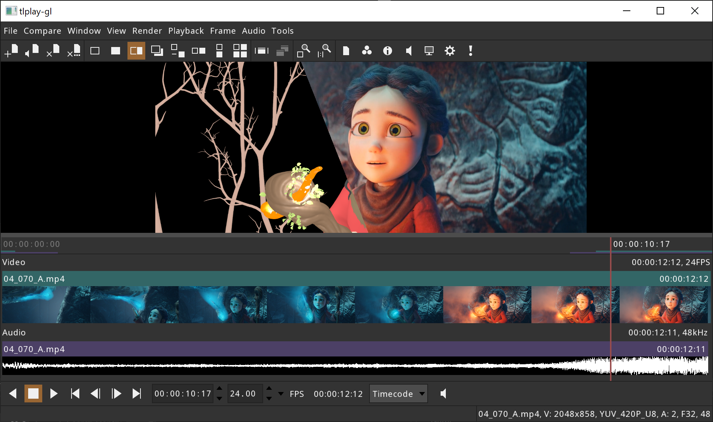

[](https://opensource.org/licenses/BSD-3-Clause)
[](https://github.com/ggarra13/tlRender/actions/workflows/ci-workflow.yml)
[](https://codecov.io/gh/ggarra13/tlRender)

tlRender
========
tlRender is an open source library for building playback and review
applications for visual effects, film, and animation.

The library can render and playback timelines with multiple video clips,
image sequences, audio clips, and transitions. Examples are provided for
integrating the library with Qt and OpenGL applications.

The library is written in C++ and uses the CMake build system.



This screenshot shows an example playback application built with the tlRender
user interface library. Two files are being compared with an A/B "wipe", a USD
animation and a rendered movie.

"Spring" content: © Blender Foundation | cloud.blender.org/spring

Currently supported:
* Movie files (.mp4, .mov, ...)
* Image file sequences (.cin, .dpx, .exr, .jpg, .png, .tiff, ...)
* Multi-channel audio
* Color management with OpenColorIO
* A/B comparison
* OpenTimelineIO .otioz file bundles

Work in progress:
* USD support

To do:
* Software rendering
* Apple Metal rendering
* Microsoft DirectX rendering
* Effects
* GPU movie decoding
* Nested timelines
* Python bindings

Contents:
* [Libraries](#Libraries)
* [Dependencies](#dependencies)
* [Building](#building)
    * [Building Dependencies](#build-dependencies)
    * [Building on Linux](#building-on-linux)
    * [Building on macOS](#building-on-macos)
    * [Building on Windows](#building-on-windows)


# Libraries

tlRender is composed of multiple libraries:


| Libraries                                | Description              |
| ---------------------------------------- | ------------------------ |
| tlCore, tlGL, tlIO, tlTimelime, tlDevice | Core libraries           |
| tlUI, tlTimelineIO                       | User interface libraries |
| tlQt, tlQtWidget, tlQtQuick              | Qt integration libraries | 


# Dependencies

Required dependencies:
* [Imath](https://github.com/AcademySoftwareFoundation/Imath)
* [nlohmann_json](https://github.com/nlohmann/json)
* [ZLIB](https://zlib.net)
* [minizip-ng](https://github.com/zlib-ng/minizip-ng)
* [OpenTimelineIO](https://github.com/PixarAnimationStudios/OpenTimelineIO)
* [FreeType](https://www.freetype.org)

Optional dependencies:
* [GLFW](https://www.glfw.org/)
* [OpenSSL](https://www.openssl.org)
* [libssh2](https://libssh2.org)
* [curl](https://curl.se/libcurl)
* [OpenColorIO](https://github.com/AcademySoftwareFoundation/OpenColorIO)
* [RtAudio](https://github.com/thestk/rtaudio)
* [libsamplerate](https://github.com/libsndfile/libsamplerate)
* [JPEG](https://libjpeg-turbo.org)
* [TIFF](http://www.libtiff.org)
* [PNG](https://libpng.sourceforge.io/index.html)
* [OpenEXR](https://www.openexr.com/)
* [FFmpeg](https://ffmpeg.org)
* [nativefiledialog-extended](https://github.com/btzy/nativefiledialog-extended)
* [Qt version 5 or 6](https://www.qt.io)


# Building

## Building Dependencies

A CMake super build script is provided to build the dependencies from source,
except for Qt. Qt should be installed separately.

## Building on Linux

Clone the repository:
```
git clone https://github.com/darbyjohnston/tlRender.git
cd tlRender
git submodule init
git submodule update
```
Create a build directory:
```
mkdir build
cd build
```
Run CMake with the super build script:
```
cmake ../etc/SuperBuild -DCMAKE_INSTALL_PREFIX=$PWD/install -DCMAKE_PREFIX_PATH=$PWD/install -DCMAKE_BUILD_TYPE=Debug
```
Start the build:
```
cmake --build . -j 4 --config Debug
```
Try running the "tlplay-gl" application:
```
export LD_LIBRARY_PATH=$PWD/install/lib:$LD_LIBRARY_PATH
./tlRender/src/tlRender-build/bin/tlplay-gl/tlplay-gl ../etc/SampleData/MultipleClips.otio
```

### Building on Linux with Qt 6

When running CMake with the super build script, add the Qt location to
"CMAKE_PREFIX_PATH" (make sure to use quotes), and enable "TLRENDER_QT6":
```
cmake ../etc/SuperBuild -DCMAKE_INSTALL_PREFIX=$PWD/install -DCMAKE_PREFIX_PATH="$PWD/install;$HOME/Qt/6.5.0/gcc_64" -DTLRENDER_QT6=ON -DCMAKE_BUILD_TYPE=Debug
```

### Building on Linux with Qt 5

When running CMake with the super build script, add the Qt location to
"CMAKE_PREFIX_PATH" (make sure to use quotes), and enable "TLRENDER_QT5":
```
cmake ../etc/SuperBuild -DCMAKE_INSTALL_PREFIX=$PWD/install -DCMAKE_PREFIX_PATH="$PWD/install;$HOME/Qt/5.15.2/gcc_64" -DTLRENDER_QT5=ON -DCMAKE_BUILD_TYPE=Debug
```

### Minimal build on Linux

Build with only the required dependencies, disabling all optional dependencies.
```
cmake ../etc/SuperBuild -DCMAKE_INSTALL_PREFIX=$PWD/install -DCMAKE_PREFIX_PATH=$PWD/install -DCMAKE_BUILD_TYPE=Debug -DTLRENDER_OCIO=OFF -DTLRENDER_AUDIO=OFF -DTLRENDER_JPEG=OFF -DTLRENDER_TIFF=OFF -DTLRENDER_STB=OFF -DTLRENDER_PNG=OFF -DTLRENDER_EXR=OFF -DTLRENDER_FFMPEG=OFF -DTLRENDER_PROGRAMS=OFF -DTLRENDER_EXAMPLES=OFF -DTLRENDER_TESTS=OFF
```

### Notes for building on Linux

Example for running gcovr for code coverage:
```
gcovr -r ../../../../lib --html --object-directory lib --html-details --output gcov.html lib/tlCore lib/tlIO lib/tlTimeline
```

## Building on macOS

Clone the repository:
```
git clone https://github.com/darbyjohnston/tlRender.git
cd tlRender
git submodule init
git submodule update
```
Create a build directory:
```
mkdir build
cd build
```
Run CMake with the super build script:
```
cmake ../etc/SuperBuild -DCMAKE_INSTALL_PREFIX=$PWD/install -DCMAKE_PREFIX_PATH=$PWD/install -DCMAKE_BUILD_TYPE=Debug
```
Start the build:
```
cmake --build . -j 4 --config Debug
```
Try running the "tlplay-gl" application:
```
./tlRender/src/tlRender-build/bin/tlplay-gl/tlplay-gl ../etc/SampleData/MultipleClips.otio
```

### Building on macOS with Qt 6

When running CMake with the super build script add the Qt location to
"CMAKE_PREFIX_PATH" (make sure to use quotes), and enable "TLRENDER_QT6":
```
cmake ../etc/SuperBuild -DCMAKE_INSTALL_PREFIX=$PWD/install -DCMAKE_PREFIX_PATH="$PWD/install;$HOME/Qt/6.5.0/macos" -DTLRENDER_QT6=ON -DCMAKE_BUILD_TYPE=Debug
```

### Building on macOS with Qt 5

When running CMake with the super build script add the Qt location to
"CMAKE_PREFIX_PATH" (make sure to use quotes), and enable "TLRENDER_QT5":
```
cmake ../etc/SuperBuild -DCMAKE_INSTALL_PREFIX=$PWD/install -DCMAKE_PREFIX_PATH="$PWD/install;$HOME/Qt/5.15.2/clang_64" -DTLRENDER_QT5=ON -DCMAKE_BUILD_TYPE=Debug
```

### Notes for building on macOS

The CMake variable "CMAKE_OSX_ARCHITECTURES" can be used to specify the build
architecture:
```
-DCMAKE_OSX_ARCHITECTURES=x86_64
```
```
-DCMAKE_OSX_ARCHITECTURES=arm64
```

These aliases are convenient for switching between architectures:
```
alias arm="env /usr/bin/arch -arm64 /bin/zsh --login"
alias intel="env /usr/bin/arch -x86_64 /bin/zsh --login"
```

## Building on Windows

Install MSYS2 (https://www.msys2.org) for compiling FFmpeg.

Clone the repository:
```
git clone https://github.com/darbyjohnston/tlRender.git
cd tlRender
git submodule init
git submodule update
```
Create a build directory:
```
mkdir build
cd build
```
Run CMake with the super build script:
```
cmake ..\etc\SuperBuild -DCMAKE_INSTALL_PREFIX=%CD%\install -DCMAKE_PREFIX_PATH=%CD%\install -DCMAKE_BUILD_TYPE=Debug
```
Start the build:
```
cmake --build . -j 4 --config Debug
```
Try running the "tlplay-gl" application:
```
set PATH=%CD%\install\bin;%PATH%
.\tlRender\src\tlRender-build\bin\tlplay-gl\Debug\tlplay-gl ..\etc\SampleData\MultipleClips.otio
```

### Building on Windows with Qt 6

When running CMake with the super build script add the Qt location to
"CMAKE_PREFIX_PATH" (make sure to use quotes), and enable "TLRENDER_QT6":
```
cmake ..\etc\SuperBuild -DCMAKE_INSTALL_PREFIX=%CD%\install -DCMAKE_PREFIX_PATH="%CD%\install;C:\Qt\6.5.0\msvc2019_64" -DTLRENDER_QT6=ON -DCMAKE_BUILD_TYPE=Debug
```

### Building on Windows with Qt 5

When running CMake with the super build script add the Qt location to
"CMAKE_PREFIX_PATH" (make sure to use quotes), and enable "TLRENDER_QT5":
```
cmake ..\etc\SuperBuild -DCMAKE_INSTALL_PREFIX=%CD%\install -DCMAKE_PREFIX_PATH="%CD%\install;C:\Qt\5.15.2\msvc2019_64" -DTLRENDER_QT5=ON -DCMAKE_BUILD_TYPE=Debug
```
